### About me

Computer Engineering student at UPE (Poli), working mostly with C and Python on Unix environments, with hands-on experience across web front end and back end, containers (Docker) and automation (n8n, REST APIs). These days I'm deep into the modern AI stack: running LLMs locally, building agents, and wiring them up with skills, MCP servers and tool use.

What I enjoy most is the engineering of the process: understanding how every step works, from polishing small apps to building complex systems.

### Currently

- **Building** tooling around coding agents and local models
- **Learning** local inference (llama.cpp, whisper.cpp), agent skills, MCP and RAG

### Featured projects

- **[OpenlyAntigravity](https://github.com/LucassTml/OpenlyAntigravity)**: OpenCode plugin that uses your own Antigravity (`agy`) terminal as an agent, so no paid API keys are needed. `JavaScript`
- **[GenAI Text-to-SQL](https://github.com/LucassTml/GenAI-WebInterface-RocketLab-2026_2)**: Text-to-SQL agent over a Databricks gold layer, with guardrails, semantic search and a Streamlit UI. `Python` `LLMs`
- **[PortfolioXP](https://lucasstml.github.io/PortfolioXP/)**: Interactive Windows XP-style portfolio with windows, start menu, terminal and mini-games. `HTML` `CSS` `JS`
- **[Overwatch-DataMeta](https://github.com/LucassTml/Overwatch-DataMeta)**: Interactive knowledge graph of Overwatch 2 heroes, counters and synergies. `D3.js` `NetworkX`

### Stack

Also: n8n, REST APIs, Pandas, PyAutoGUI · data structures & algorithms in C

### Stats

  <picture>
    <source media="(prefers-color-scheme: dark)" srcset="https://github-readme-stats.vercel.app/api?username=LucassTml&show_icons=true&hide_border=true&hide_rank=true&hide=stars%2Cissues%2Ccontribs&theme=github_dark" />
    
  </picture>
  <picture>
    <source media="(prefers-color-scheme: dark)" srcset="https://github-readme-stats.vercel.app/api/top-langs/?username=LucassTml&layout=compact&hide_border=true&langs_count=8&hide=html%2Cjupyter%20notebook&theme=github_dark" />
    
  </picture>

<picture>
  <source media="(prefers-color-scheme: dark)" srcset="https://github-profile-summary-cards.vercel.app/api/cards/profile-details?username=LucassTml&theme=github_dark" />
  
</picture>

### Contact

[Email](mailto:lemt99@gmail.com) · [Portfolio](https://lucasstml.github.io/PortfolioXP/)
